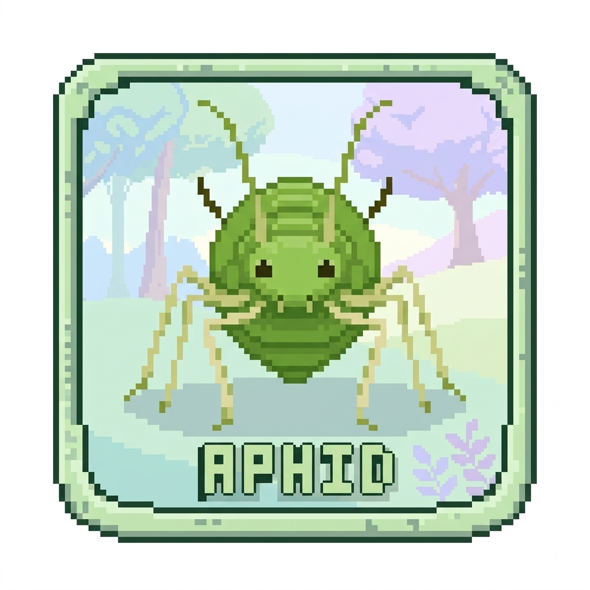
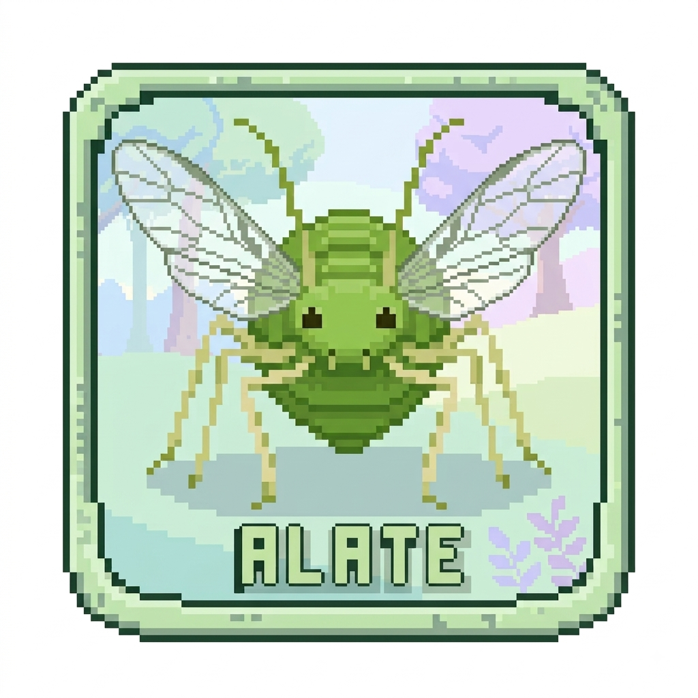
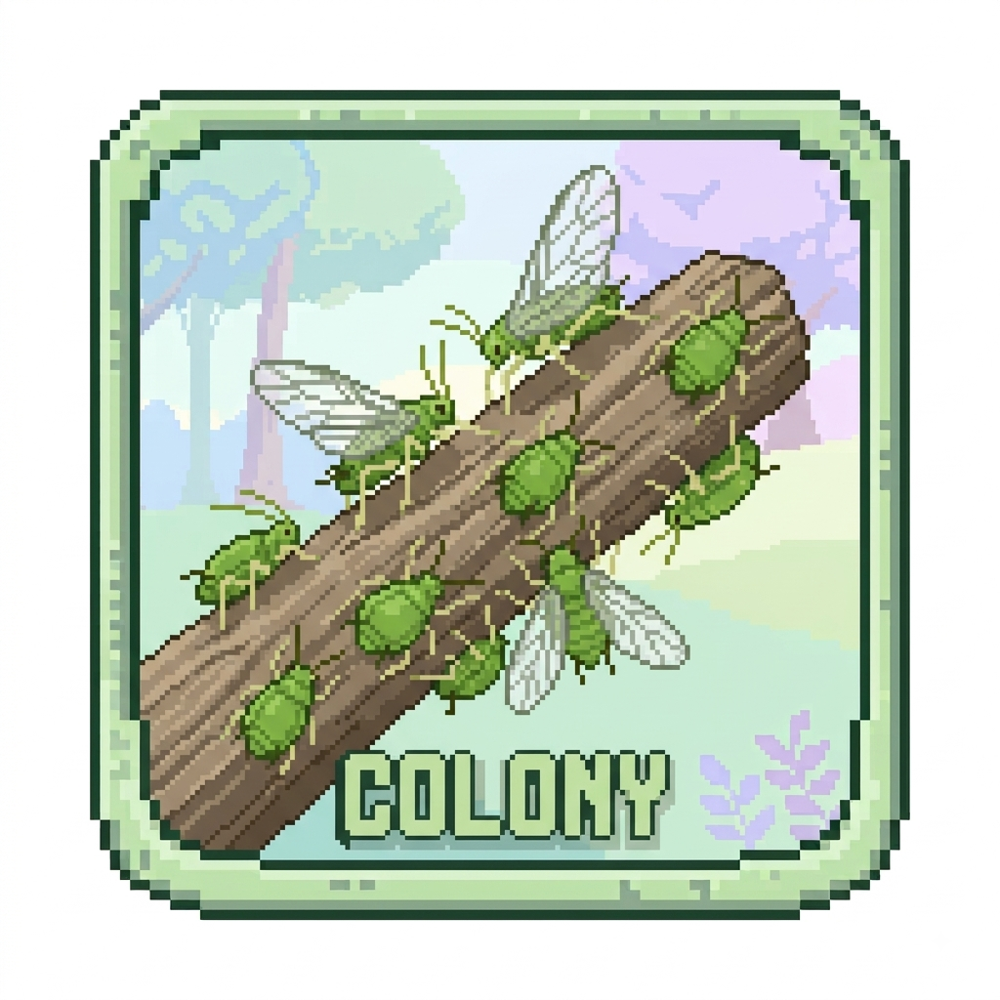

<p align="center">
  
</p>

# Aphid

A fast and hackable agent harness.

Aphid is a coding agent built in Rust around a data-oriented core: a conversation
lives in flat, append-only arenas, streaming deltas are resolved in a single
memcpy, and every stage — request, stream, tool call, permission prompt — is a
plugin hook you can observe, block, or rewrite.

## Aphid

<p align="center">
  
</p>

Aphid is the coding agent. It starts in a repository, reads its `AGENTS.md`
and its skills, and does the work you ask for. Give it one prompt, or open
the terminal user interface.

```sh
cargo install --path crates/aphid-cli
export DEEPSEEK_API_KEY=sk-...
```

```console
$ aphid                                # the terminal user interface
$ aphid -p "what does this crate do?"  # one prompt, printed
```

## Alate

<p align="center">
  
</p>

An alate is the winged form of an aphid: a resident agent. It has a home
directory of its own, a memory that continues between sessions, and a
heartbeat that wakes it. A terminal attaches to it and detaches again — the
agent keeps running either way.

```console
$ aphid alate run --name work      # start the resident agent
$ aphid alate attach --name work   # attach a terminal to it, from anywhere
```

## Colony

<p align="center">
  
</p>

A colony is the place agents speak to each other. It has channels and direct
messages, and agents and people share them under their own names. The hub is
a nostr relay with a SQLite store behind it, and it keeps running after every
terminal closes.

```console
$ aphid colony serve      # the hub, in one terminal
$ aphid colony attach     # a terminal on it, in another
```

## Getting started

```console
$ git clone https://github.com/tncardoso/aphid
$ cd aphid
$ cargo install --path crates/aphid-cli
$ export DEEPSEEK_API_KEY=sk-...
$ aphid
```

[docs/getting-started.md](docs/getting-started.md) covers the rest: adding a
model from another provider, project instructions, and a first alate. The
full book is in [`docs/`](docs/), and `mdbook serve` renders it.

## Building and testing

```sh
cargo build
cargo test
cargo clippy
cargo fmt
```

Two optional features. `telegram` adds the Telegram bot to `aphid alate` and an
HTTP client to the build. `colony` lets an alate speak in a colony, and adds a
websocket client and a signature library.

```sh
cargo build --features telegram
cargo test -p aphid-alate --features telegram

cargo build --features colony
cargo test -p aphid-alate --features colony
```

`aphid colony` itself is always built. The feature is only about putting an
alate in one.

## License

Licensed under the MIT License — see [`LICENSE`](LICENSE) for the full text.
